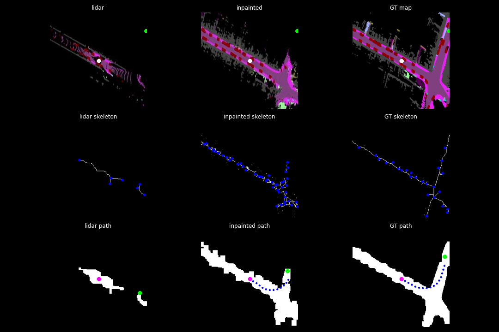

# Generative_planning
the GitHub repo for CORL 2022 accepted Oral paper "Planning Paths through Occlusions in Urban Environments"

# Inpainting model
To generate the inpainted semantic map, first type the command

```bash
cd inpainting/
```
The code and instructions to run the inpainting model are under the 'inpainting' folder.

# path planning
Then take the generated semantic maps from the inpainting foder and then type the command

```bash
cd ../
cd planner
```
The code and instructions to run the path planning method are under the 'planner' folder.

# Note for test the model
To test our model, please run the inference instruction under the 'inpainting' folder first. Then use the predicted semantic map to run the planning stage.

# Results


